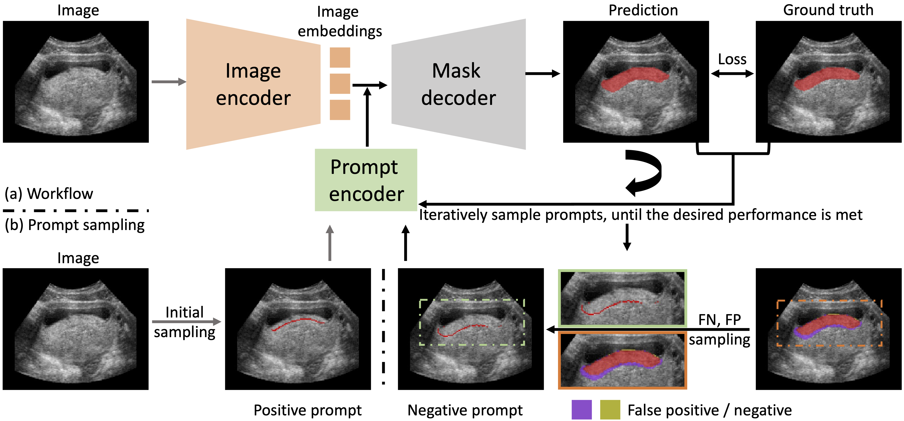
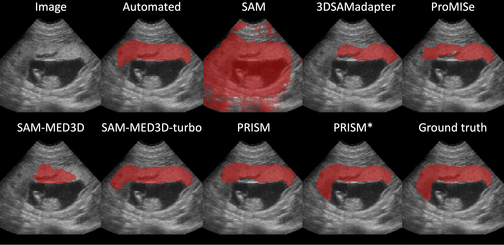
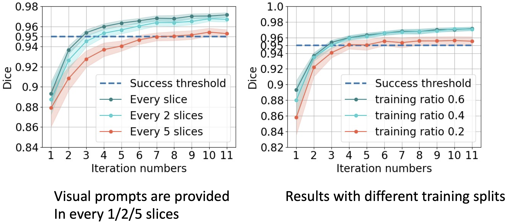

# PRISM-placenta
Interactive Segmentation Model for Placenta Segmentation from 3D Ultrasound Images

## News
[07/07/24] Repo is created.

## TL;DR
+ [PRISM](https://github.com/MedICL-VU/PRISM) is an **effective** and **efficient** 3D interactive model for [placenta](https://www.mayoclinic.org/healthy-lifestyle/pregnancy-week-by-week/in-depth/placenta/art-20044425) segmentation

+ The detailed **effective** and **efficient** results are included in our [paper](https://arxiv.org/abs/2404.15028), please check if you are interested

+ We note this is such an open area, and we keep pushing it with more analyses. Please let me know if you have any thoughts

## Workflow 
To mimic human behavior, we sample prompts from the FN and FP regions of the current segmentation at each iteration. The initial sampling only has positive prompts.



## Effective 
The quantitative results can be viewed in our [paper](https://arxiv.org/abs/2404.15028), briefly, mean Dice scores are 0.9 for automated and 0.97 for [PRISM](https://github.com/MedICL-VU/PRISM).
Qualitative results with compared methods. We tested the performance of nnUnet, and it is worse than our state-of-the-art model (automated).



## Efficient
We consider a Dice score of 0.95 as a bar for success, which is higher than inter-rater variability (0.85-0.90)





## Datasets
We used the in-house dataset, the details can be viewed in other papers from our group (you can find them in the **Reference** section in the paper)


## Get Started

**Installation**
```
conda create -n prism python=3.9
conda activate prism
sudo install git
pip install torch==1.12.1+cu113 torchvision==0.13.1+cu113 --extra-index-url https://download.pytorch.org/whl/cu113 # install pytorch
pip install git+https://github.com/facebookresearch/segment-anything.git # install segment anything packages
pip install git+https://github.com/deepmind/surface-distance.git # for normalized surface dice (NSD) evaluation
pip install -r requirements.txt
```


**Train**

```
python train.py --data ultrasound --data_dir your_data_directory --save_name your_save_name --multiple_outputs --dynamic --use_box --refine
```

add "--use_scribble" and "--efficient_scribble" if you want to train with scribbles.

**Train (Distributed Data Parallel)**

the only difference between this and above (train) command is the use of "--ddp".
```
python train.py --data ultrasound --data_dir your_data_directory --save_name your_save_name -multiple_outputs --dynamic --use_box --refine --ddp
```


**Test**
```
python test.py --data ultrasound --data_dir your_data_directory --split test --checkpoint best --save_name prism_pretrain --num_clicks 1 --iter_nums 11 --multiple_outputs --use_box --use_scribble --efficient_scribble --refine --refine_test
```


**FAQ**

if you got the error as AttributeError: module 'cv2' has no attribute 'ximgproc', please check [this](https://stackoverflow.com/questions/57427233/module-cv2-cv2-has-no-attribute-ximgproc) out

This repo is tested to reproduce the results in our paper. However, I haven't cleaned the code, and it has some arguments for past/future efficient or effective analyses.

## License

The model is licensed under the [Apache 2.0 license](LICENSE)


## Acknowledgements
Thanks for the code from these work: [SAM](https://github.com/facebookresearch/segment-anything), [SAM-Med3D](https://github.com/uni-medical/SAM-Med3D), [ProMISe](https://github.com/MedICL-VU/ProMISe), [ScribblePrompt](https://github.com/halleewong/ScribblePrompt), [nnU-Net](https://github.com/MIC-DKFZ/nnUNet)


If you find this repository useful, please consider citing this paper:
```
@article{li2024prism,
  title={PRISM: A Promptable and Robust Interactive Segmentation Model with Visual Prompts},
  author={Li, Hao and Liu, Han and Hu, Dewei and Wang, Jiacheng and Oguz, Ipek},
  journal={arXiv preprint arXiv:2404.15028},
  year={2024}
}
```
Please send an email to hao.li.1@vanderbilt.edu for any questions, and we are always happy to help! :)
